# React Query Architecture Overview

A simplified view of how React Query works in this Next.js app with SSR/SSG support.

```mermaid
flowchart TD
    subgraph "Build Time"
        GRAPHQL["📄 GraphQL Queries<br/>(*.graphql files)"]
        GRAPHQL -->|"npm run codegen"| HOOKS["🔧 Generated Hooks<br/>useFeedsQuery()<br/>useDetectionsQuery()<br/>etc."]
    end

    subgraph "Server-Side (SSR/SSG)"
        PAGE["📄 Next.js Page<br/>getServerSideProps"]
        PAGE -->|"uses"| SERVERHOOK["useFeedsQuery.fetcher()"]
        SERVERHOOK --> SERVERQC["Server QueryClient<br/>(temporary instance)"]
        SERVERQC --> DEHYDRATE["dehydrate()<br/>Converts cache to JSON"]
    end

    subgraph "Client-Side Setup"
        APP["📱 _app.tsx"]
        APP --> CLIENTQC["Browser QueryClient<br/>(persistent instance)"]
        APP --> PROVIDER["&lt;QueryClientProvider&gt;"]
        PROVIDER --> HYDRATE["HydrationBoundary"]
    end

    DEHYDRATE -.->|"passes data"| HYDRATE

    subgraph "Runtime (Browser)"
        COMPONENT["Your Component"]
        COMPONENT -->|"import & use"| CLIENTHOOK["const { data } = useFeedsQuery()"]
        CLIENTHOOK -->|"checks"| CLIENTQC2[/"QueryClient Cache"/]
        CLIENTQC2 -->|"cache hit"| RETURN["Return data"]
        CLIENTQC2 -->|"cache miss"| FETCH["Fetch from API"]
        FETCH -->|"updates"| CLIENTQC2
        RETURN --> COMPONENT
    end

    %% External connections
    HOOKS -->|"provides"| CLIENTHOOK
    HOOKS -->|"provides"| SERVERHOOK
    HYDRATE -->|"pre-fills"| CLIENTQC2
    CLIENTQC -.->|"same instance"| CLIENTQC2

    CONFIG["⚙️ Shared Config<br/>endpoint, cache time, fetcher"]
    CONFIG -.->|"used by"| SERVERQC
    CONFIG -.->|"used by"| CLIENTQC

    style COMPONENT fill:#e8f5e9
    style HOOKS fill:#f3e5f5
    style DEHYDRATE fill:#fff3e0
    style HYDRATE fill:#e1f5fe
    style CLIENTHOOK fill:#e3f2fd
    style SERVERHOOK fill:#e3f2fd
    style FETCH fill:#ffebee
```



## Key Concepts Explained

### 🔄 Two QueryClients

- **Server QueryClient**: Created fresh for each request during SSR/SSG
- **Browser QueryClient**: Lives throughout the app session
- Both use the same configuration but are separate instances

### 📦 Dehydration/Hydration

Think of it like freeze-drying data:

- **Dehydrate**: Server converts fetched data to JSON (freeze-dry)
- **HydrationBoundary**: Client receives and "rehydrates" this data
- Result: No duplicate API calls when the page loads!

### 🔧 Code Generation

```bash
npm run codegen
```

- Reads your `.graphql` files
- Generates typed React hooks
- No manual hook writing needed!

### 🎯 Using React Query

```tsx
// In your component - this is all you need!
import { useFeedsQuery } from "@/graphql/generated";

function FeedsList() {
  const { data, isLoading, error } = useFeedsQuery();

  if (isLoading) return <div>Loading...</div>;
  if (error) return <div>Error!</div>;

  return <div>{/* Use your data */}</div>;
}
```

### 📝 The Flow

1. **Build Time**: GraphQL queries → Generated hooks
2. **Server Time**:
   - Page uses `useFeedsQuery.fetcher()` to prefetch data
   - Server QueryClient fetches and stores data
   - Data is dehydrated to JSON
3. **Client Setup**:
   - Browser QueryClient is created
   - HydrationBoundary receives dehydrated data
   - Cache is pre-filled with server data
4. **Runtime**:
   - Component calls `useFeedsQuery()`
   - Hook checks QueryClient cache first
   - Returns data immediately (no network call needed!)
   - Refetches automatically when data becomes stale

### 🎯 Key Insight

The same generated hooks work everywhere:

- **Server**: Use `.fetcher()` method for prefetching
- **Client**: Use the hook directly for reactive data
- Both use the same configuration and endpoint!
